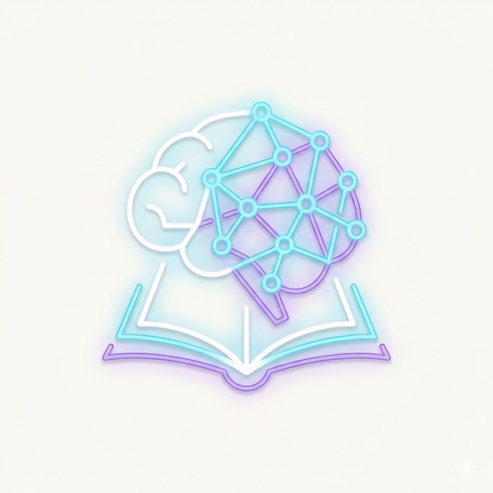

# Technical Knowledge Base



A premium, searchable technical blog and knowledge base built with Next.js and Markdown.

## Live Site
**[my-temp-blog.vercel.app](https://my-temp-blog.vercel.app/)**

## Features
- **Fast & Searchable**: Blazing fast static site generation (SSG).
- **Premium UI**: Glassmorphism design with Dark/Light mode support.
- **Note Creator**: Integrated local interface for drafting new technical notes.
- **Tested**: Comprehensive test suite with automated **GitHub Actions** CI/CD.

## Structure
- `content/`: All raw markdown notes categorized by topic.
- `app/`: Next.js application logic and styled components.
- `lib/`: Markdown parsing and utility functions.

## Docker
Run your blog in a container:

```bash
# Build and start
docker compose up --build -d
```

## Troubleshooting

### 1. Application Not Starting
- **Check Logs**: If `npm run dev` fails, look for port conflicts (is another app on port 3000?).
- **Dependencies**: Run `npm install` again if you see "Module not found" errors.
- **Node Version**: Ensure you are using Node 18 or higher (`node -v`).

### 2. Docker Issues
- **Logs**: If the container starts but doesn't work, run `docker compose logs -f` to see the internal output.
- **Build Failures**: Ensure the Docker daemon is running and you have enough disk space. If it hangs on "Installing dependencies", try `docker builder prune` to clear the cache.
- **Port Conflict**: If port 3000 is taken, change the left side of the mapping in `docker-compose.yml` (e.g., `"3001:3000"`).

### 3. Missing Content
- **Permissions**: If notes aren't appearing, ensure the `content/` folder is readable by the application user.
- **Paths**: Double check that your markdown files are in the correct category folders under `content/`.

---
*For a full list of all raw files in this repository, see [INDEX.md](./INDEX.md).*
